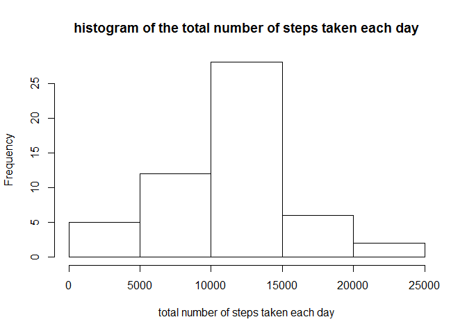
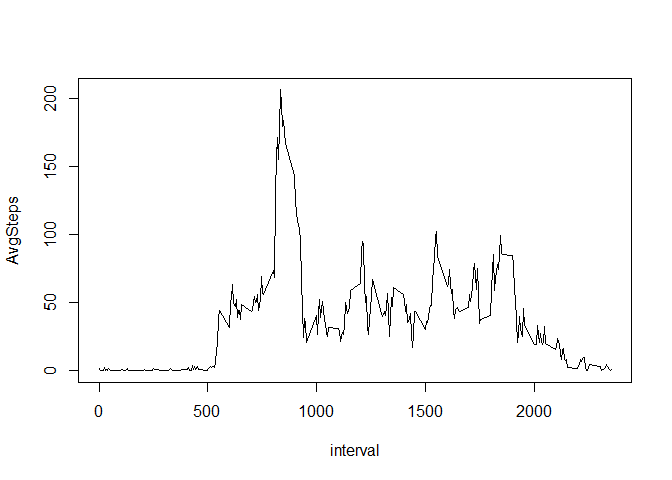
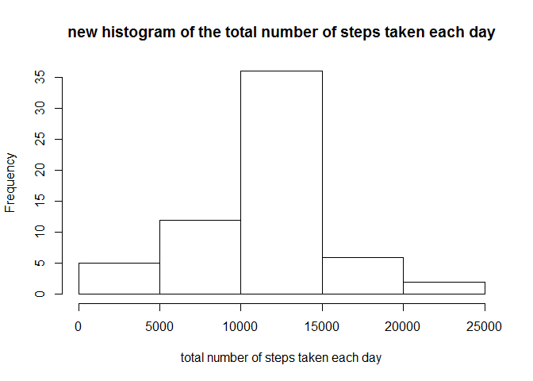
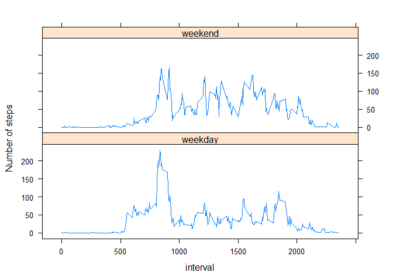

# Reproducible Research: Peer Assessment 1

sets the default option to print the code/results unless otherwise specified
```{r setoptions, echo = TRUE} opt_chunk$set(echo = TRUE, results ="asis")
```

## Loading and preprocessing the data

1.Load the data

```r
#the data should be in your working directory, you may use setwd()
setwd("C:/Users/Alan GZ Li/Desktop/R_File/Reproducible Research")
data <- read.csv("./activity.csv",header = TRUE,na.strings="NA")
```

2.Process/transform the data into a format suitable

```r
data$date <- as.Date(data$date)
head(data)
```

```
##   steps       date interval
## 1    NA 2012-10-01        0
## 2    NA 2012-10-01        5
## 3    NA 2012-10-01       10
## 4    NA 2012-10-01       15
## 5    NA 2012-10-01       20
## 6    NA 2012-10-01       25
```

## What is mean total number of steps taken per day?

1.Calculate the total number of steps taken per day

```r
library(sqldf)
```

```
## Loading required package: gsubfn
## Loading required package: proto
## Loading required package: RSQLite
## Loading required package: DBI
```

```r
Steps_PerDate <- sqldf("select date,sum(steps) as TotalSteps from data group by date")
```

```
## Loading required package: tcltk
```

```r
Steps_PerDate$TotalSteps <- as.numeric(Steps_PerDate$TotalSteps)
head(Steps_PerDate)
```

```
##         date TotalSteps
## 1 2012-10-01         NA
## 2 2012-10-02        126
## 3 2012-10-03      11352
## 4 2012-10-04      12116
## 5 2012-10-05      13294
## 6 2012-10-06      15420
```

2. Make a histogram of the total number of steps taken each day

```r
#histogram
with(Steps_PerDate,hist(TotalSteps,xlab="total number of steps taken each day",
                        main="histogram of the total number of steps taken each day"))
```

 

3.Calculate and report the mean and median of the total number of steps taken per day

```r
mean <- mean(Steps_PerDate$TotalSteps,na.rm = TRUE)
mean
```

```
## [1] 10766.19
```

```r
median <- median(Steps_PerDate$TotalSteps,na.rm = TRUE)
median
```

```
## [1] 10765
```

## What is the average daily activity pattern?

1.Make a time series plot (i.e. type = "l") of the 5-minute interval (x-axis) and the average number of steps taken, averaged across all days (y-axis)

```r
Steps_PerInterval <- sqldf("select interval,avg(steps) as AvgSteps from data group by interval")
Steps_PerInterval$AvgSteps <- as.numeric(Steps_PerInterval$AvgSteps)
head(Steps_PerInterval)
```

```
##   interval  AvgSteps
## 1        0 1.7169811
## 2        5 0.3396226
## 3       10 0.1320755
## 4       15 0.1509434
## 5       20 0.0754717
## 6       25 2.0943396
```

```r
with(Steps_PerInterval,plot(interval,AvgSteps,type="l"))
```

 

2.Which 5-minute interval, on average across all the days in the dataset, contains the maximum number of steps?

```r
Steps_PerInterval[which.max(Steps_PerInterval$AvgSteps),]
```

```
##     interval AvgSteps
## 104      835 206.1698
```

## Imputing missing values

1.Calculate and report the total number of missing values in the dataset (i.e. the total number of rows with NAs)

```r
sqldf("select count(*) as NAs_count from data where steps is null")
```

```
##   NAs_count
## 1      2304
```

2.Use the mean for that 5-minute interval to fill in all of the missing values in the dataset. 

```r
MeanSteps_PerInterval <- sqldf("select interval,avg(steps) as steps from data where steps is not null group by interval")
head(MeanSteps_PerInterval)
```

```
##   interval steps
## 1        0     1
## 2        5     0
## 3       10     0
## 4       15     0
## 5       20     0
## 6       25     2
```

```r
data_NA <- sqldf("select y.steps,x.date,x.interval from data x left join MeanSteps_PerInterval y on x.interval=y.interval where x.steps is null")
head(data_NA)
```

```
##   steps       date interval
## 1     1 2012-10-01        0
## 2     0 2012-10-01        5
## 3     0 2012-10-01       10
## 4     0 2012-10-01       15
## 5     0 2012-10-01       20
## 6     2 2012-10-01       25
```

3.Create a new dataset that is equal to the original dataset but with the missing data filled in.

```r
data_new <- rbind(subset(data,!is.na(steps)),data_NA)
data_new <- sqldf("select * from data_new order by date")
head(data_new)
```

```
##   steps       date interval
## 1     1 2012-10-01        0
## 2     0 2012-10-01        5
## 3     0 2012-10-01       10
## 4     0 2012-10-01       15
## 5     0 2012-10-01       20
## 6     2 2012-10-01       25
```

4.Make a histogram of the total number of steps taken each day and Calculate and report the mean and median total number of steps taken per day. Do these values differ from the estimates from the first part of the assignment? What is the impact of imputing missing data on the estimates of the total daily number of steps?

```r
#Make a histogram of the total number of steps taken each day
Steps_PerDate_new <- sqldf("select date,sum(steps) as TotalSteps from data_new group by date")
Steps_PerDate_new$TotalSteps <- as.numeric(Steps_PerDate_new$TotalSteps)
head(Steps_PerDate_new)
```

```
##         date TotalSteps
## 1 2012-10-01      10641
## 2 2012-10-02        126
## 3 2012-10-03      11352
## 4 2012-10-04      12116
## 5 2012-10-05      13294
## 6 2012-10-06      15420
```

```r
with(Steps_PerDate_new,hist(TotalSteps,xlab="total number of steps taken each day",
                            main="new histogram of the total number of steps taken each day"))
```

 

```r
#Calculate and report the mean and median total number of steps taken per day
mean_new <- mean(Steps_PerDate_new$TotalSteps,na.rm = TRUE)
mean_new
```

```
## [1] 10749.77
```

```r
median_new <- median(Steps_PerDate_new$TotalSteps,na.rm = TRUE)
median_new
```

```
## [1] 10641
```

```r
#differ
mean_differ <- mean_new-mean
mean_differ
```

```
## [1] -16.41819
```

```r
median_differ <- median_new-median
median_differ
```

```
## [1] -124
```

Results:imputing missing data on the estimates of the total daily number of steps, decrease the mean by 16.4181874 and mediam by 124.

## Are there differences in activity patterns between weekdays and weekends?

1.Create a new factor variable in the dataset with two levels – “weekday” and “weekend” indicating whether a given date is a weekday or weekend day.

```r
data_new$weekdays <- weekdays(data_new$date)
head(data_new)
```

```
##   steps       date interval weekdays
## 1     1 2012-10-01        0   Monday
## 2     0 2012-10-01        5   Monday
## 3     0 2012-10-01       10   Monday
## 4     0 2012-10-01       15   Monday
## 5     0 2012-10-01       20   Monday
## 6     2 2012-10-01       25   Monday
```

```r
data_new <- sqldf("select x.*,case when weekdays in ('Saturday','Sunday')  then 'weekend' else 'weekday' end as day_type from data_new x")
data_new$day_type <- as.factor(data_new$day_type)
head(data_new)
```

```
##   steps       date interval weekdays day_type
## 1     1 2012-10-01        0   Monday  weekday
## 2     0 2012-10-01        5   Monday  weekday
## 3     0 2012-10-01       10   Monday  weekday
## 4     0 2012-10-01       15   Monday  weekday
## 5     0 2012-10-01       20   Monday  weekday
## 6     2 2012-10-01       25   Monday  weekday
```

2.Make a panel plot containing a time series plot (i.e. type = "l") of the 5-minute interval (x-axis) and the average number of steps taken, averaged across all weekday days or weekend days (y-axis). See the README file in the GitHub repository to see an example of what this plot should look like using simulated data.

```r
Steps_PerInterval_new <- sqldf("select day_type,interval,avg(steps) as Avg_steps from data_new group by day_type,interval")
head(Steps_PerInterval_new)
```

```
##   day_type interval  Avg_steps
## 1  weekday        0 2.15555556
## 2  weekday        5 0.40000000
## 3  weekday       10 0.15555556
## 4  weekday       15 0.17777778
## 5  weekday       20 0.08888889
## 6  weekday       25 1.57777778
```

```r
library(lattice)
xyplot(Avg_steps~interval|day_type,data=Steps_PerInterval_new,type="l",layout=c(1,2),ylab="Number of steps")
```

 

<Done>

